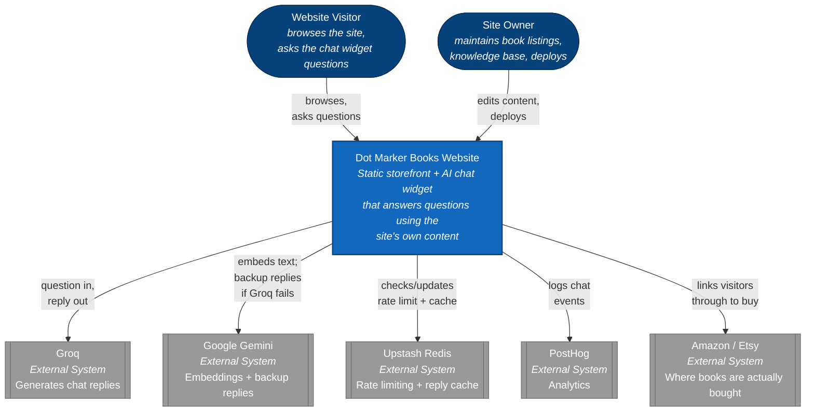
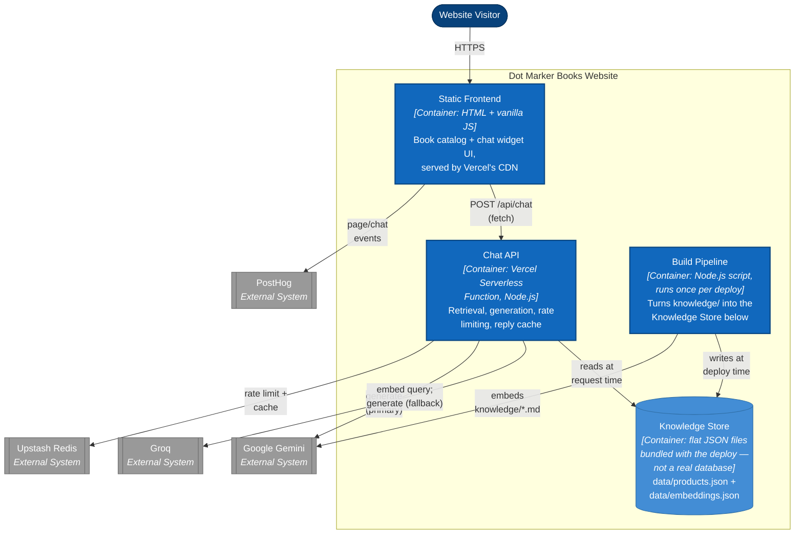
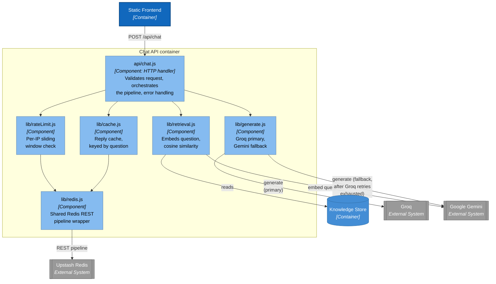

# Architecture diagrams (C4 model)

Three levels of zoom, from "what is this, for an executive" down to "what's
inside the one piece of code doing the real work." See the
[C4 model](https://c4model.com/) for the general framework this follows.

> **Why plain `flowchart` instead of Mermaid's native `C4Context`/
> `C4Container`/`C4Component` syntax**: GitHub's bundled Mermaid renderer
> doesn't include the C4 extension (confirmed as of mid-2026 — see
> [this GitHub discussion](https://github.com/orgs/community/discussions/197898)),
> so that syntax renders as broken raw text in a GitHub-viewed `.md` file.
> These use plain flowcharts styled to the same conventions instead (navy =
> person, blue = internal container/component, grey = external system),
> which GitHub renders reliably — same approach as the diagrams in the
> main README.

## Level 1: System Context

The whole system as one box, and everyone/everything outside it that talks
to it. No internals — this is the version to show someone who needs the
5-second picture, not the code.

Notably absent, on purpose: **Vercel** (the host) isn't shown — a context
diagram is about who *uses* and *depends on* the system, not what it runs
on top of. It matters at the Container level below instead.

## Level 2: Container

The deployable pieces inside that one box, and which external system each
one actually talks to.

Two pieces of the prompt's usual container vocabulary are deliberately
**absent** here, not just forgotten:
- **Message broker** — none exists. Every call in this system is a direct
  synchronous HTTP request; nothing is queued or event-driven. There's no
  background job that would need one.
- **Search index / database** — the closest equivalent is the "Knowledge
  Store," but it's two flat JSON files bundled straight into the Chat API's
  deployment package, not a running database server or vector index. At 10
  total chunks, a real index would be solving a problem this project
  doesn't have yet (see the README's Architecture section for the same
  reasoning applied to `MIN_SIMILARITY_SCORE`/`TOP_K`).

## Level 3: Component

Inside the **Chat API** container — the one with all the actual decision
logic (the other containers are comparatively simple: the frontend is one
static file, the build pipeline is a single linear script).

`lib/redis.js` is drawn once but called from two places (`rateLimit.js` and
`cache.js`) — it's the shared low-level REST wrapper both higher-level
components sit on top of, not a third independent path to Redis.
